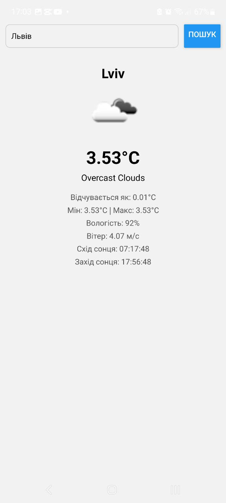
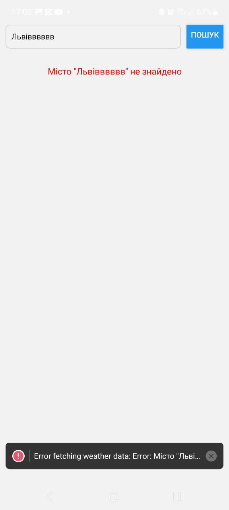

# Додаток "Погода"

React Native додаток для відображення поточної погоди з використанням TypeScript та OpenWeatherMap API.

## Встановлення

1. Клонуйте репозиторій

2. Встановіть залежності:

   ```bash
   npm install
   ```

3. Запустіть проєкт:
   ```bash
   npx expo start
   ```

## Використані технології

- React Native
- TypeScript
- Expo
- Expo Router
- OpenWeatherMap API

## Функціонал

- Пошук погоди за назвою міста
- Відображення поточної температури, відчуття як, мін/макс температур
- Вологість та швидкість вітру
- Час сходу та заходу сонця
- Індикатор завантаження
- Обробка помилок (неправильна назва міста)

## Скріншоти




